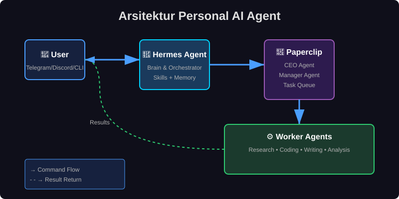

# Personal AI Agent Guide 🤖

Panduan lengkap membangun **personal AI agent** menggunakan Hermes Agent untuk otomasi kerja, manajemen tugas, dan orchestration multi-agent.

## 🚀 Mengapa Personal AI Agent?

Di era di mana AI bukan lagi sekadar chatbot, memiliki personal AI agent yang bisa berpikir, mendelegasikan tugas, dan bekerja secara otonom adalah game-changer. Dengan Hermes Agent, Anda tidak hanya mendapatkan asisten — Anda mendapatkan **tim AI** yang bekerja 24/7.

Bayangkan: Anda bangun pagi, cek Telegram, dan menemukan bahwa agent Anda sudah menyelesaikan riset kompetitor, draft email penting, dan menyiapkan laporan mingguan. Semua itu terjadi sementara Anda tidur. Itulah kekuatan personal AI agent yang terorchestrasi dengan baik.

### Apa yang Akan Anda Pelajari

- Setup Hermes Agent dari nol (VPS kosong → gateway aktif)
- Integrasi dengan Paperclip untuk orchestration CEO/Manager pattern
- Arsitektur sistem yang scalable dan mudah dipelihara
- Best practices untuk SEO dan GEO-friendly documentation

## 📚 Dokumentasi

| Dokumen | Deskripsi |
|---------|-----------|
| [Setup Guide](docs/setup-guide.md) | Panduan instalasi step-by-step dari VPS kosong sampai gateway aktif |
| [Paperclip Integration](docs/paperclip-integration.md) | Cara setup dan dispatch task ke Paperclip (CEO/Manager pattern) |

## 🏗️ Arsitektur

Flow sederhana: **User → Hermes → Paperclip → Workers**

Hermes bertindak sebagai otak utama yang menerima perintah natural language, sementara Paperclip mengorchestrasi worker-worker khusus untuk eksekusi tugas spesifik. Pattern CEO/Manager memungkinkan delegasi hierarkis yang efisien.

## 🔑 Keyword Utama

- personal AI agent
- Hermes Agent
- orchestration
- autonomous agents
- AI workflow automation
- multi-agent system

## 🎯 Untuk Siapa?

Guide ini ditujukan untuk developer dan tech enthusiast Indonesia yang ingin:
- Mengotomasi pekerjaan repetitif dengan AI
- Membangun sistem agent yang bisa belajar dari pengalaman
- Memahami arsitektur orchestration multi-agent
- Deploy agent pribadi di infrastruktur sendiri

## 🤝 Kontribusi

Repo ini terbuka untuk kontribusi. Silakan fork, buat branch, dan submit PR dengan perubahan yang berarti. Kami menghargai setiap improvement pada dokumentasi, contoh kode, atau best practices baru.

## 📄 Lisensi

MIT License — gunakan, modifikasi, dan distribusikan sesuai kebutuhan.

---

*Dibuat dengan ❤️ untuk komunitas developer Indonesia yang ingin menguasai personal AI agent dan orchestration.*